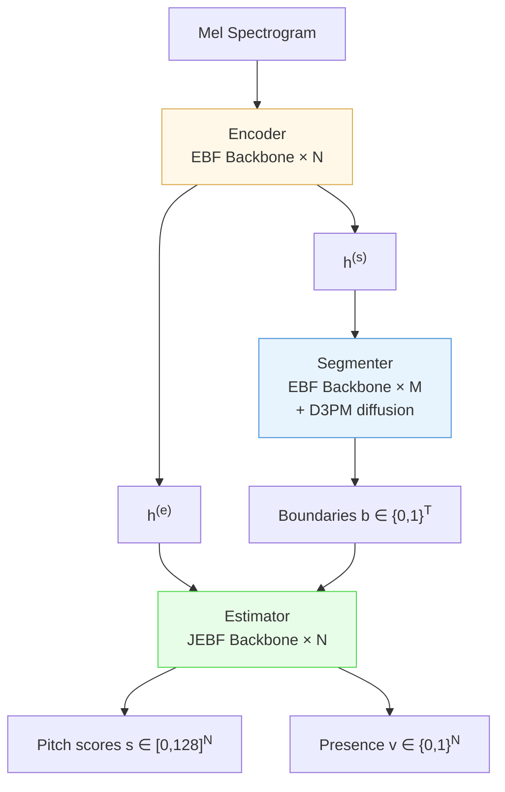
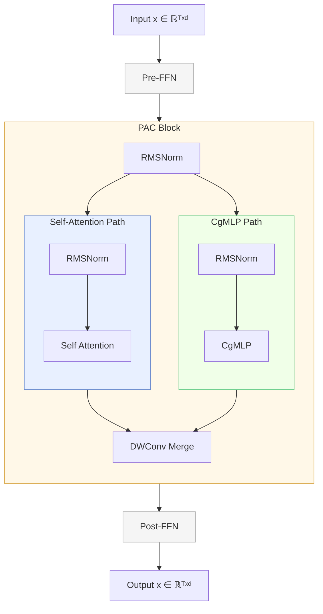
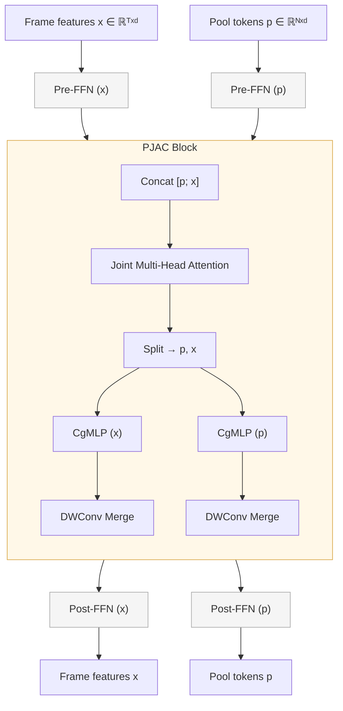

# Algorithms and Methodology

## 1. Introduction

GAME (Generative Adaptive MIDI Extractor) is a deep learning system for automatic singing voice transcription (AST) — converting monophonic singing voice audio into musical note sequences with precise onset/offset boundaries and continuous pitch values. It is the successor to [SOME](https://github.com/openvpi/SOME) and represents a significant architectural departure from both its predecessor and contemporary AST systems such as [ROSVOT](https://arxiv.org/abs/2405.09940).

The system's defining characteristic is the use of **structured discrete diffusion (D3PM)** for boundary detection, replacing the conventional single-pass discriminative approach with an iterative generative process. This enables a tunable quality–speed trade-off and provides a principled mechanism for incorporating prior knowledge (e.g., word boundaries from forced alignment) as conditioning signals.

This report describes the algorithms, model architectures, loss formulations, and training methodology that underpin GAME.

---

## 2. Problem Formulation

Given a monophonic singing voice waveform, the goal is to produce a sequence of notes $\{ (p_i, \text{onset}_i, \text{offset}_i) \}_{i=1}^{M}$ where $p_i \in \mathbb{R}$ is the continuous MIDI pitch and onset/offset are in seconds. Note duration is implicitly determined by adjacent boundaries — it does not appear as an explicit model output.

Internally, the model operates on a mel-spectrogram with time step $\Delta t = 10~\text{ms}$ (hop size 441 samples at 44100 Hz sample rate). Let $T$ be the number of frames. GAME segments the input into $N$ note/rest regions. Each region may be voiced ($v_i = 1$, a sung note) or unvoiced ($v_i = 0$, a rest or unpitched segment); only voiced regions are converted into output MIDI notes. The model produces:

1. **Boundaries** $b \in \{0, 1\}^T$: transition boundaries between adjacent regions. The phrase start and end act as implicit boundaries, so there are $\sum_t b_t = N - 1$ explicit internal boundaries partitioning the phrase into $N$ regions.
2. **Regions** $r \in \{1, \dots, N\}^T$: derived from boundaries via cumulative sum, $r_t = 1 + \sum_{s \leq t} b_s$, mapping each frame to its containing region index (0 is reserved for padding). The onset of region 1 is the phrase start; the onset of region $i > 1$ is the $(i-1)$-th boundary frame. The offset of region $i$ is the onset of region $i+1$ (or the phrase end for the last region).
3. **Pitch values** $s \in [0, 128]^N$: continuous MIDI pitch for each region.
4. **Presence** $v \in \{0, 1\}^N$: whether each region is voiced (has a pitch) or unvoiced (rest). Presence is not predicted by a separate head; it is derived from the pitch-bin activations (§5.3).

---

## 3. Architecture Overview

GAME employs a **three-stage encoder–segmenter–estimator** design. All three submodules are built from two shared backbone types — EBF and JEBF — with RoPE positional encoding throughout.

### 3.1 Overall Pipeline

- **Encoder**: A 4-layer EBF backbone projects the 80-bin mel spectrogram to $2d$ dimensions, processes it, then splits the output into $h^{(s)}$ and $h^{(e)}$ (each $d$), the hidden representations for segmentation and estimation.
- **Segmenter**: An 8-layer EBF backbone predicts frame-level boundary logits from $h^{(s)}$, conditioned on a noisy region map, a D3PM timestep $t$, and an optional language embedding. During training boundaries are corrupted by a D3PM forward process; during inference they are iteratively refined through the reverse process.
- **Estimator**: A 4-layer JEBF backbone predicts per-region pitch values from $h^{(e)}$ and a region map $r$ derived from boundaries. During training, ground-truth boundaries are used; during inference, predicted boundaries from the segmenter are used instead. The architecture uses MMDiT-style joint attention between learnable *pool tokens* and frame-level features.

### 3.2 EBF Backbone

The EBF layer (used by both encoder and segmenter backbones) consists of three sub-blocks with residual connections, pre-norm (RMSNorm), and LayerScale (a per-channel learnable scaling factor, initialized to $10^{-6}$, applied to the output of each sub-block before the residual addition):

$$
\begin{aligned}
x' &= x + \gamma_1 \odot \tfrac{1}{2}\,\text{FFN}_1(\text{Norm}_1(x)) \\
x'' &= x' + \gamma_2 \odot \text{PAC}(x') \\
\text{EBF}(x) &= x'' + \gamma_3 \odot \tfrac{1}{2}\,\text{FFN}_2(\text{Norm}_2(x''))
\end{aligned}
$$

where $\gamma_1, \gamma_2, \gamma_3 \in \mathbb{R}^d$ are per-channel learnable LayerScale parameters, each initialized to $10^{-6}$.

The PAC (Parallel Attention + Convolution) block runs self-attention and a convolutional MLP in parallel, then merges their outputs through a depthwise convolution:

$$
\text{PAC}(x) = \text{MergeConv}\big([\,\text{Attn}(\text{Norm}_a(x)) \;\|\; \text{CgMLP}(\text{Norm}_c(x))\,]\big)
$$

- **Self-Attention**: Multi-head scaled dot-product attention with RoPE.
- **CgMLP**: Depthwise-separable convolution with a gated linear unit (GLU). A $1\!\times\!1$ convolution expands channels to $2d_{\text{inner}}$, a GELU activation is applied, then the result is split into gate and value halves. The value path goes through RMSNorm and a depthwise convolution (kernel size $k_m$) followed by another GELU, then the gate and value are multiplied element-wise. A final $1\!\times\!1$ convolution projects back to dimension $d$. The depthwise kernel size is $k_m = 31$ in all EBF backbones.
- **Merge**: Concatenated attention and CgMLP outputs pass through a depthwise convolution ($k_m$) with residual connection, then a linear projection back to the hidden dimension $d$. In all model scales, $k_m = 31$ frames (310 ms).
- **FFN**: Gated Linear Unit with $4\times$ expansion ratio and GELU activation.

#### RoPE Positional Encoding

Standard 1D rotary position embedding (RoPE) on queries and keys. Let $\text{rotate}(\cdot)$ swap adjacent dimension pairs and negate the first element: $[x_0, x_1, x_2, x_3, \dots] \mapsto [-x_1, x_0, -x_3, x_2, \dots]$. For position $pos$:

$$
\text{RoPE}(x, pos) = x \odot \cos(pos \cdot \Theta) + \text{rotate}(x) \odot \sin(pos \cdot \Theta)
$$

where $\Theta_k = 10000^{-2k/d}$ for $k = 0, \dots, d/2-1$. Both queries and keys receive the same transformation: $\text{RoPE}(q, k, pos) = (\text{RoPE}(q, pos),\; \text{RoPE}(k, pos))$.

### 3.3 JEBF Backbone

The JEBF backbone extends the EBF pattern to two parallel streams — frame features $\mathbf{x}$ and learnable *pool tokens* $\mathbf{p}$ — processed through MMDiT-style joint attention. Each JEBF layer has dual FFNs (one per stream) flanking a PJAC block:

$$
\begin{aligned}
\mathbf{p} &\leftarrow \mathbf{p} + \text{FFN}_p(\text{Norm}(\mathbf{p})) \\
\mathbf{x} &\leftarrow \mathbf{x} + \text{FFN}_x(\text{Norm}(\mathbf{x})) \\
\mathbf{p}', \mathbf{x}' &\leftarrow \text{PJAC}(\mathbf{p}, \mathbf{x}, r) \\
\mathbf{p} &\leftarrow \mathbf{p} + \mathbf{p}' ;\quad \mathbf{x} \leftarrow \mathbf{x} + \mathbf{x}' \\
\mathbf{p} &\leftarrow \mathbf{p} + \text{FFN}_p(\text{Norm}(\mathbf{p})) \\
\mathbf{x} &\leftarrow \mathbf{x} + \text{FFN}_x(\text{Norm}(\mathbf{x}))
\end{aligned}
$$

The PJAC (Parallel Joint Attention + Convolution) block concatenates the two streams, runs a single joint attention, splits the result back, then applies per-stream CgMLP convolutions and merges via depthwise convolution (analogous to PAC but with separate kernel sizes for x and pool: $k_x = 31$ for frame features, $k_p = 7$ for the pool stream CgMLP, with merge kernels of 31 and 5 respectively):

The joint attention mask and mixed RoPE scheme (global for same-stream, per-region local for cross-stream) are detailed in §5.2.

After the backbone, pool tokens are aggregated (mean by default) and projected to the output dimension.

---

## 4. Generative Boundary Extraction via D3PM

This is the core algorithmic innovation of GAME. Rather than predicting boundaries directly from the spectrogram (as in SOME and ROSVOT), GAME frames boundary detection as **iterative denoising in a discrete state space**.

### 4.1 D3PM Formulation

**State space**: Each frame $t$ can be in one of two states: $b_t \in \{0, 1\}$ (non-boundary or boundary). The full boundary sequence is $b \in \{0, 1\}^T$.

**Forward (noising) process**: Given ground-truth boundaries $b_0$, we obtain a noisy version $b_t$ at timestep $t$ by independently removing each boundary with probability $p(t)$:

$$
P(b_t[i] = 0 \mid b_0[i] = 1) = p(t)
$$
$$
P(b_t[i] = 0 \mid b_0[i] = 0) = 1
$$

The probability $p(t)$ follows a **cosine schedule** (inspired by continuous diffusion models):

$$
p(t) = \frac{1 + \cos(t\pi)}{2}, \quad t \in [0, 1]
$$

where $t = 0$ corresponds to maximum noise ($p = 1$, all boundaries removed) and $t = 1$ corresponds to no noise ($p = 0$, original boundaries preserved). Note that this time parameterization is reversed compared with the conventional diffusion notation (where $t=0$ denotes clean data). The cosine schedule changes slowly near both endpoints and most rapidly around the middle ($t = 0.5$), matching the behavior observed in continuous diffusion models with cosine schedules.

**Reverse (denoising) process**: The model learns $p_\theta(b_0 \mid h^{(s)}, b_t, t)$ — the conditional distribution over clean boundaries given the noisy observation and the acoustic features. We adopt the $x_0$-prediction variant: the model directly predicts the clean boundary sequence, which is then re-noised to continue the iterative refinement, rather than predicting a one-step reverse transition. This is analogous to the $x_0$-parameterization in continuous diffusion models.

Note that this forward process is an **absorbing diffusion**: boundaries can only be removed ($1 \to 0$), never spontaneously created ($0 \to 1$). The absorbing state is the all-zero sequence. During training, the corrupted boundary sequence $b_t$ is always a subset of the ground-truth $b_0$, so the denoising objective focuses on recovering missing boundaries. At inference time, false positives may arise from the model's own predictions and are handled indirectly through re-noising and local-maximum decoding (§4.4).

### 4.2 Training

During training, for each sample:

1. A random timestep $t \sim U(0, 1)$ is sampled.
2. The removal probability $p = \frac{1+\cos(t\pi)}{2}$ is computed.
3. Ground-truth boundaries $b_0$ are corrupted: each boundary is removed independently with probability $p$, yielding $b_t$.
4. The noisy region map $r_t$ is derived from $b_t$ via cumulative sum: $r_t[i] = 1 + \sum_{j \leq i} b_t[j]$.
5. The segmenter receives $h^{(s)}$ (from encoder), $r_t$ (noisy regions), $t$ (timestep), and optional language ID.

The **region map** $r_t$ is embedded through a cyclic region embedding scheme. A learned embedding table of $C = 3$ entries (each a $d$-dimensional vector) is indexed by $(r_t \bmod C)$. Since $C$ is small, region indices $k$ and $k + C$ share the same embedding — this prevents the model from learning absolute region identities while still distinguishing adjacent regions (e.g. regions 1, 2, and 3 get distinct embeddings, but region 4 reuses region 1's embedding). During training, a random integer shift is added before the modulo to prevent the model from overfitting to specific remainder values. The resulting $d$-dimensional embedding is added to $h^{(s)}$.

The **timestep** $t$ is embedded through a two-layer MLP ($d \to 4d \to d$) with GELU activation, producing a $d$-dimensional time conditioning vector broadcast-added to $h^{(s)}$.

The **language ID** is embedded through a standard embedding layer and added to $h^{(s)}$ with 50% dropout during training (forcing the model to work both with and without language cues).

The segmenter outputs frame-level logits $\ell \in \mathbb{R}^T$, trained to recover the clean boundaries $b_0$ (see Section 6.2 for loss formulation).

### 4.3 Inference: Iterative Denoising

At inference time, the model performs $K$ denoising steps. The algorithm accepts an optional set of *known boundaries* $b_\text{known}$ (e.g., word boundaries from forced alignment) that are treated as immutable throughout the process:

**Algorithm: D3PM Iterative Sampling**
$$
\begin{aligned}
&\text{Input: } h^{(s)} \in \mathbb{R}^{T \times d},\; \text{mask} \in \{0,1\}^T,\; \text{language\_id},\; K,\; b_\text{known} \in \{0,1\}^T,\; \tau,\; \rho \\
&\text{Output: } b \in \{0,1\}^T \\
&b \leftarrow b_\text{known} \\
&\Delta t \leftarrow 1 / K \\
&\textbf{for } i = 0, \dots, K-1 \textbf{ do} \\
&\quad t \leftarrow i \cdot \Delta t \\
&\quad p \leftarrow (1 + \cos(t\pi)) / 2 \\
&\quad b \leftarrow \text{remove\_mutable}(b,\; b_\text{known},\; p) \quad \text{(§4.5)} \\
&\quad r \leftarrow \text{cumsum}(b) + 1 \\
&\quad \ell \leftarrow \text{Segmenter}(h^{(s)},\; r,\; t,\; \text{language\_id}) \\
&\quad b \leftarrow \text{soft\_boundary\_decode}(\sigma(\ell),\; \text{barriers}{=}b_\text{known},\; \tau,\; \rho) \\
&\textbf{end for} \\
&\textbf{return } b
\end{aligned}
$$

When $b_\text{known} = \mathbf{0}$ (no external boundaries provided), the algorithm reduces to standard unconditional generation: $\text{remove\_mutable}$ behaves as uniform removal and no barriers constrain the decoder.

The key insight is that at each step, the current boundary prediction is *re-noised* by randomly removing boundaries according to the schedule, then the model *re-predicts* all boundaries. This process gradually refines the boundary positions: early steps (high $p$, low $t$) remove many boundaries, forcing the model to make coarse structural decisions; later steps (low $p$, high $t$) preserve most boundaries, allowing fine-grained adjustment. The stochastic removal of *predicted* boundaries at each step implements a form of self-consistency regularization.

When known boundaries are provided, only mutable (predicted) boundaries are removed during re-noising; the known boundaries remain fixed throughout all $K$ steps. During decoding, known boundaries act as barriers — they are excluded from local-maximum detection, so the model only inserts additional boundaries in the gaps between them. This enables the alignment use case: given word or phrase boundaries, the segmenter fills in the finer note-level onsets within each segment.

### 4.4 Boundary Decoding

The segmenter logits are converted to hard boundary predictions via soft boundary decoding:

1. Apply sigmoid: $\hat{b}_\text{soft} = \sigma(\ell)$.
2. Find **local maxima** within radius $r = 2$ frames ($\pm 20$ ms) of $\hat{b}_\text{soft}$.
3. Filter by threshold $\tau = 0.2$: only local maxima above $\tau$ are retained.
4. If external *barriers* are provided (e.g., known word boundaries), they are treated as already occupied positions and excluded.

This local-maximum decoding ensures a minimum spacing between detected boundaries and produces clean, well-separated onsets.

### 4.5 Boundary Manipulation Primitives

The D3PM module provides two manipulation primitives that support the training and inference algorithms:

**Uniform boundary removal**: Each boundary in $b$ is independently removed with probability $p$:

$$
P(b'_t = 0 \mid b_t = 1) = p
$$

**Mutable-aware boundary removal**: Given a set of *immutable* boundaries (e.g., known word boundaries from forced alignment that must not be destroyed), removal is restricted to the remaining mutable subset. To keep the expected number of surviving boundaries consistent regardless of how many are immutable, the removal probability is scaled:
$$
P_\text{adj} = \min\!\left(1,\; \frac{n \cdot p}{m}\right)
$$

where $n$ is the total boundary count, $m$ the mutable count, and $p$ the target removal rate. Each mutable boundary is then independently removed with probability $P_\text{adj}$. When $m = 0$ (all boundaries are immutable), no removal is performed.

---

## 5. Adaptive Pitch Estimation

The estimator predicts a continuous MIDI pitch value for each note region. Unlike the segmenter, which operates at the frame level, the estimator operates at the *note level* using a joint attention architecture that connects per-note *pool tokens* with frame-level acoustic features.

### 5.1 Region Conditioning

The estimator receives $h^{(e)}$ (from encoder) and a region map $r \in \{0, 1, \dots, N\}^T$ (where $r_t = 0$ indicates padding). The region map can come from:
- **Ground-truth boundaries** (during training).
- **Predicted boundaries from the segmenter** (during inference).
- **Externally provided boundaries** (e.g., word boundaries from forced alignment).

This is what makes the architecture *adaptive*: the estimator can work with any boundary source, enabling use cases like word-to-note alignment and interactive pitch estimation from user-adjusted boundaries.

The region map is embedded through the same cyclic region embedding scheme as in the segmenter (§4.2), added to $h^{(e)}$ before entering the backbone.

### 5.2 Frame-to-Token Aggregation

#### Pool Tokens

Each note region is represented by one learnable *pool token* — a learned embedding that serves as a query for aggregating frame-level information belonging to that region. Given $N$ regions, pool tokens form an $N \times d$ tensor per sample, generated by expanding a per-region prototype $\mathbf{p}_0 \in \mathbb{R}^{d}$ across all $N$ positions. Although all pool tokens share the same learned prototype, their region identities are determined by the attention mask (which binds the $i$-th pool token to the $i$-th region's frames), by their sequential positions in the pool-stream RoPE encoding, and by cross-region information sharing through pool-pool same-stream attention.

#### Region-Conditioned Attention

The cross-stream attention mask restricts each pool token to attend only to frames within its corresponding region:

$$
\text{AttnMask}[i, j] = \begin{cases} 1 & \text{if same\_stream}(i, j) \lor \text{same\_region}(i, j) \\ 0 & \text{otherwise} \end{cases}
$$

where $\text{same\_stream}(i, j)$ is true when tokens $i$ and $j$ belong to the same stream (both pool or both frame), and $\text{same\_region}(i, j)$ holds when the region ID of token $i$ equals that of token $j$. Since all pool tokens can attend to each other via the same-stream rule, they can share information across regions — this is intentional, allowing the estimator to model inter-note dependencies such as relative pitch relationships. Optionally, a **soft region bias** replaces the hard mask with a learned distance penalty:

$$
\text{bias}(i, j) = -\alpha \cdot |r_i - r_j|
$$

with $\alpha$ being a single learnable scalar, allowing controlled cross-region information flow.

#### Mixed RoPE Scheme

The joint attention uses a mixed rotary position embedding that splits each attention head's dimension into two halves:

- **Global half**: encodes absolute sequential positions ($0, 1, 2, \dots$) for all tokens, giving each token a unique position index in the concatenated pool+frame sequence.
- **Region-relative half**: encodes positions within each region. Frame tokens receive their offset within their containing region ($0, 1, \dots$ from the region start). Pool tokens all receive the same position (0), reflecting that they represent entire regions rather than specific temporal offsets.

Both halves are applied to the same queries and keys via RoPE, so the attention score between any two tokens incorporates both global and region-relative position information. The same RoPE transformation is applied uniformly to all four attention pathways (pool→pool, frame→frame, pool→frame, frame→pool) without per-pathway specialization, keeping the joint attention computation unified.

### 5.3 Pitch Decoding

After the JEBF backbone, pool tokens are projected to $K = 257$ bins through a linear layer, producing per-note pitch logits. The logits are decoded via Gaussian-blurred centroid estimation:

1. Apply sigmoid to obtain per-bin probabilities: $\text{probs}[k] = \sigma(\ell^\text{note}_k)$.
2. Find the bin with maximum probability: $\hat{c} = \arg\max_k \text{probs}[k]$.
3. Define a window of width $w = \lceil 3\sigma_p / \Delta k \rceil$ around $\hat{c}$, where $\sigma_p = 0.5$ semitones and $\Delta k$ is the bin width.
4. Compute the weighted centroid:
$$
p = \frac{\sum_{k=\hat{c}-w}^{\hat{c}+w} \text{probs}[k] \cdot \text{center}[k]}{\sum_{k=\hat{c}-w}^{\hat{c}+w} \text{probs}[k]}
$$
5. Determine presence: $\text{presence} = \max_k \text{probs}[k] \geq \tau_v$, where $\tau_v = 0.2$. No separate presence classifier head exists — presence is derived from the same $257$-bin pitch logits. When a region is predicted as unvoiced, its pitch value is unused.

The weighted centroid recovers continuous pitch values from the quantized bin representation, producing floating-point MIDI values suitable for expressive synthesis.

---

## 6. Loss Functions

GAME uses three complementary loss terms, each targeting a different aspect of the transcription:

### 6.1 Regional Cosine Similarity Loss

$$
\mathcal{L}_\text{region} = 1 - \frac{\sum_{i,j} \text{sign}_{ij} \cdot \text{cos\_sim}(x_i, x_j) \cdot \text{mask}_{ij}}{\sum_{i,j} \text{mask}_{ij}}
$$

where $x \in \mathbb{R}^{T \times 16}$ is an intermediate latent from the segmenter, and the sign and mask matrices are defined over frame pairs $(i, j)$:

$$
\text{sign}_{ij} = \begin{cases} +1 & \text{if } r_i = r_j \quad \text{(same region: positive pull)} \\ -\exp\big(1 - |r_i - r_j|\big) & \text{if } r_i \neq r_j \;\text{and}\; |r_i - r_j| \leq w \quad \text{(nearby different: negative push)} \\ 0 & \text{otherwise (masked out)} \end{cases}
$$

$$
\text{mask}_{ij} = \mathbb{1}[|r_i - r_j| \leq w] \land \mathbb{1}[r_i \neq 0] \land \mathbb{1}[r_j \neq 0] \land \mathbb{1}[i < j]
$$

with neighborhood size $w = 5$.

This is a **contrastive loss** operating on the segmenter's internal representation: it encourages the latent features of frames within the same note region to be similar (cosine similarity → 1), while pushing apart features of neighboring but different regions. The exponential decay factor ($-\exp(1 - |r_i - r_j|)$) makes the repulsive force weaker for regions that are farther apart, focusing the contrastive signal on temporally adjacent regions where boundary localization is most critical. The upper-triangular mask avoids double-counting. No explicit negative samples are mined — the loss naturally contrasts all valid frame pairs within the neighborhood.

### 6.2 Gaussian Soft Boundary Loss

$$
\mathcal{L}_\text{boundary} = \text{BCEWithLogits}\big(\ell,\; b_\text{soft}\big)
$$

where $\ell \in \mathbb{R}^T$ are the boundary logits and $\text{soften}(\cdot)$ applies a Gaussian blur to the ground-truth binary boundaries with kernel width $\sigma_b = 1.0$:

$$
b_\text{soft}[i] = \exp\!\left(-\frac{1}{2} \cdot \frac{d(i)^2}{\sigma_b^2}\right), \qquad
d(i) = \min_{j: b_0[j]=1} |i - j|
$$

No implicit edge boundaries are added. If a sample has no ground-truth boundaries, the distance transform yields $d(i) = \infty$ for all frames, the Gaussian blur gives $b_\text{soft}[i] = 0$ everywhere, and the loss correctly encourages the model to predict no boundaries. When boundaries are present, $d(i)$ is naturally well-defined as the distance to the nearest explicit boundary.

This softening acknowledges the inherent ambiguity in boundary localization: a boundary at frame $i$ vs. frame $i+1$ (a 10 ms difference) is perceptually negligible. The Gaussian kernel spreads the boundary target across neighboring frames, with $\sigma_b = 1.0$ corresponding to roughly $\pm 3$ frames ($\pm 30$ ms) of significant probability mass.

### 6.3 Gaussian Blurred Bins Loss

$$
\mathcal{L}_\text{note} = \text{BCEWithLogits}\big(\ell^\text{note},\; \text{blur}(p_0, v_0)\big)
$$

where $\ell^\text{note} \in \mathbb{R}^{N \times 257}$ are per-note logits over $K = 257$ uniformly spaced bins covering MIDI range $[0, 128]$. The target is constructed by placing a Gaussian kernel at the ground-truth pitch value:

$$
t_k = v_0 \cdot \exp\left(-\frac{1}{2} \cdot \frac{(\text{center}_k - p_0)^2}{\sigma_p^2}\right)
$$

where $\sigma_p = 0.5$ semitones (converted to bin space) and $v_0 \in \{0, 1\}$ is the ground-truth presence flag (0 for rest notes zeros out all bins).

The 257-bin quantization with $\sigma_p = 0.5$ semitones provides substantial overlap between adjacent bins, turning what would be a classification problem into a soft regression. The BCE loss treats each bin as an independent binary target, which has been shown to produce better-calibrated continuous predictions than cross-entropy or direct regression for this type of task.

### 6.4 Combined Loss

The total loss is a simple sum:

$$
\mathcal{L}_\text{total} = \mathcal{L}_\text{region} + \mathcal{L}_\text{boundary} + \mathcal{L}_\text{note}
$$

---

## 7. Data Augmentation for Robustness

GAME trains with an extensive online augmentation pipeline applied to each sample independently. The pipeline consists of:

### 7.1 Waveform-Domain Augmentations

1. **Colored noise** ($p = 0.25$): Noise with power spectral density $\propto (1/f)^\beta$ where $\beta \sim U(0, 2)$ (white noise at $\beta = 0$, pink at $\beta = 1$, brown at $\beta = 2$), added at a random amplitude gain of $10^{-6}$ to $10^{-1}$ relative to unit-variance noise.
2. **Natural noise** ($p = 0.25$): Up to 3 different environmental or music recordings are randomly selected, cropped, independently pitch-shifted ($\pm 1$ octave via playback speed) and gain-scaled, then summed together before being mixed with the waveform at SNR 6–24 dB.
3. **RIR reverb** ($p = 0.25$): Convolution with room impulse responses.

### 7.2 Pitch Shifting

Pitch shifting ($p = 0.5$, $\pm 12$ semitones) adjusts the STFT parameters and mel filterbank to shift the spectrogram without resampling the waveform. The corresponding note labels are shifted by the same amount.

### 7.3 Spectrogram-Domain Augmentations

1. **Loudness scaling** ($p = 0.5$): Gain adjustment of $\pm 6$ dB applied to the mel spectrogram (multiplicative scaling in linear power space, additive shift in log-mel space).

2. **Spectrogram masking** (applied as a single combined augmentation): Time masking and frequency masking are sampled independently ($p = 0.15$ each), then applied together. When both are active, they may intersect with probability $p = 0.5$:

   - **Time masking**: A contiguous segment of up to 50 frames (500 ms) is filled with zero-mean Gaussian noise with a randomly sampled standard deviation, simulating temporal dropouts.
   - **Frequency masking**: A contiguous band of up to 20 mel bins is filled with Gaussian noise whose mean and standard deviation are independently randomized, simulating narrowband interference.
   - **Intersection mode**: When both masks are active and intersect, only the intersection region (time × frequency rectangle) is filled with noise, leaving the rest of the spectrogram intact. When they do not intersect, time masking fills a horizontal stripe across all frequency bins, and frequency masking fills a vertical stripe across all time frames, applied independently.

The combination of waveform-level and spectrogram-level augmentations, particularly the heavy use of natural noise and reverb, is what enables the model to work on *dirty or separated voice* — audio that contains residual accompaniment, environmental noise, or reverberation.

---

## 8. Evaluation Metrics

GAME employs a comprehensive set of metrics spanning boundary quality, pitch accuracy, and note-level overlap. All metrics are computed on the validation split of the training dataset (held-out recordings from the same singers).

Let the predicted and ground-truth boundary sequences be $\hat{b}, b \in \{0, 1\}^T$, and the frame-level predictions and targets (after flattening per-note estimates back to frames via the region map) be $\hat{p}, p \in \mathbb{R}^T$ for pitch scores and $\hat{v}, v \in \{0, 1\}^T$ for presence indicators.

### 8.1 Boundary Metrics

Let $B$ be the total number of evaluation samples. For each sample, let $b \in \{0,1\}^T$ be the ground-truth boundary sequence with $|b| = \sum_t b_t$ explicit boundaries, which partition the phrase into $|b| + 1$ regions. The implicit start-of-phrase and end-of-phrase act as additional boundaries for distance computation.

**Average Chamfer Distance** — the mean bidirectional frame distance between predicted and ground-truth boundary sets. Both sequence edges are treated as implicit boundaries (via padding of 1 on each side) to avoid degenerate cases when either set is empty. For each sample, let $I(b) = \{i \mid b_i = 1\} \cup \{-1, T\}$ be the set of boundary positions including the two implicit edges. The per-sample unnormalized distance is:

$$
U(\hat{b}, b) = \frac{1}{2}\left( \sum_{i \in I(b)} \min_{j \in I(\hat{b})} |i - j| + \sum_{j \in I(\hat{b})} \min_{i \in I(b)} |j - i| \right)
$$

The aggregate metric is the sum of per-sample unnormalized distances divided by the sum of per-sample boundary set sizes ($|I(b)| = |b| + 2$):

$$
\text{ACD} = \frac{\sum_s U(\hat{b}_s, b_s)}{\sum_s (|b_s| + 2)}
$$

This is equivalent to a weighted average of per-sample mean distances, with each sample weighted by $(|b_s| + 2)$.

**Quantity Error Rate (QER)** — measures the discrepancy in region count. A boundary $\hat{b}_i$ is a true positive if there exists a ground-truth boundary $b_j$ within tolerance $\tau = 5$ frames ($\pm 50$ ms) such that they are mutual nearest neighbors:

$$
\text{TP}(i) \iff \exists j: |i - j| \leq \tau \;\land\; \text{NN}(\hat{b}, i) = j \;\land\; \text{NN}(b, j) = i
$$

False positives $\text{FP} = |\hat{b}| - \text{TP}$ are unmatched predicted boundaries, and false negatives $\text{FN} = |b| - \text{TP}$ are unmatched ground-truth boundaries. Since $k$ explicit boundaries partition a sample into $k + 1$ regions, the total number of regions across all $B$ samples is $\sum_s (|b_s| + 1) = |b| + B$. Using this region count as the reference:

$$
\text{QER} = \frac{\text{FP} + \text{FN}}{|b| + B}
$$

**Quantity Precision/Recall** — computed from the same matching, with one implicit region-start counted per sample in both numerator and denominator (reflecting that each sample always contains at least one region):

$$
P_q = \frac{\text{TP} + B}{\text{TP} + \text{FP} + B}, \qquad R_q = \frac{\text{TP} + B}{\text{TP} + \text{FN} + B}
$$

The $+B$ terms account for the implicit region-start per sample, which stabilizes the metrics when a sample has few or zero predicted boundaries.

### 8.2 Frame-Level Pitch Metrics

Per-note predictions and ground truth are each flattened to frame level via their respective region maps: predicted pitches $\hat{s}$ are broadcast to frames using the predicted regions $\hat{r}$, while ground-truth pitches $s$ are broadcast using the ground-truth regions $r$. This means boundary errors propagate into the frame-level pitch metrics — if a predicted boundary is offset, frames near the boundary will be assigned to the wrong predicted note.

**Note Presence Precision/Recall/F1** — binary classification of voiced vs. unvoiced frames:
$$
P_v = \frac{\sum_t \hat{v}_t \cdot v_t}{\sum_t \hat{v}_t}, \qquad R_v = \frac{\sum_t \hat{v}_t \cdot v_t}{\sum_t v_t}, \qquad F_1 = \frac{2 P_v R_v}{P_v + R_v}
$$

**Raw Pitch RMSE** — root mean squared error on voiced frames only:

$$
\text{RMSE} = \sqrt{ \frac{ \sum_t v_t \cdot (\hat{p}_t - p_t)^2 }{ \sum_t v_t } }
$$

**Raw Pitch Accuracy (RPA)** — fraction of voiced frames where pitch error is within tolerance $\delta = 0.5$ semitones:

$$
\text{RPA} = \frac{ \sum_t v_t \cdot \mathbb{1}[|\hat{p}_t - p_t| \leq \delta] }{ \sum_t v_t }
$$

**Overall Accuracy (OA)** — fraction of all frames where both the presence decision is correct and (for voiced frames) the pitch is within tolerance:

$$
\text{OA} = \frac{1}{T} \sum_t \Big( (\hat{v}_t = v_t) \;\land\; \big( \neg v_t \;\lor\; |\hat{p}_t - p_t| \leq \delta \big) \Big)
$$

This is the most comprehensive single metric, requiring correctness on both the discrete voiced/unvoiced decision and the continuous pitch value.

### 8.3 Note-Level Overlap Metrics

Each note is modeled as a rectangle in time–pitch space: spanning its full duration in the time dimension and $[p - w/2,\; p + w/2]$ in the pitch dimension, where $w = 0.5$ semitones is the overlap width. The overlap between predicted and ground-truth note sets is:

$$
O = \sum_t \big( \hat{v}_t \land v_t \big) \cdot \max\big(0,\; w - |\hat{p}_t - p_t|\big)
$$

**Overlap Precision/Recall** — the ratio of overlapping area to total predicted/target area:

$$
P_o = \frac{O}{w \cdot \sum_t \hat{v}_t}, \qquad R_o = \frac{O}{w \cdot \sum_t v_t}
$$

Unlike RPA, which is binary (correct if error $\leq 0.5$ semitones), the overlap score is continuous: partial credit is awarded proportional to pitch proximity, with zero overlap when error exceeds $w$.

These metrics penalize both boundary errors (time misalignment) and pitch errors (vertical misalignment) jointly.

---

## 9. Experimental Setup

### 9.1 Training Data

Models were trained on ~32 hours of manually labeled private singing voice data across 4 languages (English, Japanese, Cantonese, Chinese Mandarin). Online augmentation used the following public datasets:

| Augmentation                  | Datasets                                                                                                                                                                                                                                                                                                                                |
|-------------------------------|-----------------------------------------------------------------------------------------------------------------------------------------------------------------------------------------------------------------------------------------------------------------------------------------------------------------------------------------|
| Natural noise & accompaniment | [DEMAND](https://www.kaggle.com/datasets/chrisfilo/demand), [MUSAN](https://www.openslr.org/17/), [MIR-1K](https://www.kaggle.com/datasets/datongmuyuyi/mir1k), [MusicNet](https://www.kaggle.com/datasets/imsparsh/musicnet-dataset), [MUSDB18-HQ](https://www.kaggle.com/datasets/quanglvitlm/musdb18-hq), private ethnic instruments |
| Room impulse responses        | [MB-RIRs](https://zenodo.org/records/15773093)                                                                                                                                                                                                                                                                                          |

The validation split contains 100 held-out recordings.

### 9.2 Model Specifications

GAME 1.0 is released in three scales. All use the same training configuration template (`configs/midi.yaml`) and mel-spectrogram parameters: sample rate 44100 Hz, hop size 441 samples (10 ms/frame), FFT size 2048, 80 mel bins covering 0–8000 Hz. Frame-based metrics below can be converted to milliseconds by multiplying by 10.

|                      | small | medium | large |
|----------------------|-------|--------|-------|
| **Embedding dim**    | 128   | 256    | 256   |
| **Attention heads**  | 4     | 8      | 8     |
| **Encoder layers**   | 4     | 4      | 8     |
| **Segmenter layers** | 8     | 8      | 16    |
| **Estimator layers** | 4     | 4      | 8     |
| **Parameters**       | 12.7M | 49.9M  | 99.0M |

### 9.3 Training Configuration

| Parameter         | Value                                                                           |
|-------------------|---------------------------------------------------------------------------------|
| Optimizer         | AdamW ($\text{lr} = 2 \times 10^{-4}$, $\beta = [0.9, 0.98]$, weight decay = 0) |
| LR Schedule       | Step decay ($\gamma = 0.8$ every 10,000 steps), no warmup                       |
| Steps             | Trained until convergence                                                       |
| Precision         | Bfloat16 mixed                                                                  |
| Batch Size        | Dynamic (max 32000 frames, max 32 samples)                                      |
| Gradient Clipping | 1.0                                                                             |

All three model scales use the same training configuration.

---

## 10. Evaluation

All evaluations use 16-bit mixed precision. The D3PM segmenter can trade quality for speed by varying the number of denoising steps $K$. For each model, a sweep over $K \in \{1, 2, 4, 8, 16\}$ is performed to determine the optimal setting, defined by the lowest **Quantity Error Rate** (the most comprehensive boundary metric). The best value per model is **bolded** in the sweep tables.

### 10.1 Clean Evaluation

**Clean — Quantity Error Rate** $\downarrow$

| $K$ | small      | medium     | large      |
|-----|------------|------------|------------|
| 1   | 0.1360     | 0.1324     | **0.1287** |
| 2   | **0.1313** | 0.1292     | 0.1350     |
| 4   | 0.1376     | 0.1271     | 0.1292     |
| 8   | 0.1381     | **0.1230** | 0.1298     |
| 16  | 0.1454     | 0.1303     | 0.1355     |

**Full metrics at optimal $K$** (lowest QER per model):

|                                       | small ($K{=}2$) | medium ($K{=}8$) | large ($K{=}1$) |
|---------------------------------------|-----------------|------------------|-----------------|
| **Avg Chamfer Distance** $\downarrow$ | 1.50            | **1.44**         | **1.44**        |
| **Quantity Error Rate** $\downarrow$  | 0.1313          | **0.1230**       | 0.1287          |
| **Quantity Precision** $\uparrow$     | 0.9537          | **0.9591**       | 0.9543          |
| **Quantity Recall** $\uparrow$        | 0.9130          | **0.9161**       | 0.9151          |
| **Presence F1** $\uparrow$            | 0.9914          | **0.9923**       | 0.9915          |
| **Raw Pitch RMSE** $\downarrow$       | 0.653           | **0.552**        | 0.684           |
| **Raw Pitch Accuracy** $\uparrow$     | **0.9499**      | 0.9486           | 0.9492          |
| **Overall Accuracy** $\uparrow$       | 0.9499          | **0.9503**       | **0.9503**      |
| **Overlap Precision** $\uparrow$      | **0.7981**      | 0.7953           | 0.7959          |
| **Overlap Recall** $\uparrow$         | **0.7966**      | 0.7950           | 0.7951          |

### 10.2 Robustness (Dirty) Evaluation

To measure robustness, each sample is evaluated a second time on a *dirty* spectrogram generated by passing the original waveform through the training augmentation pipeline in destructive-only mode (colored/natural noise mixing, RIR reverb convolution, and spectrogram time/frequency masking, without pitch shifting). The same deterministic augmentation chain is used across all three model sizes for fair comparison.

**Dirty — Quantity Error Rate** $\downarrow$

| $K$ | small      | medium     | large      |
|-----|------------|------------|------------|
| 1   | 0.1459     | 0.1397     | 0.1464     |
| 2   | 0.1522     | 0.1417     | 0.1506     |
| 4   | 0.1470     | **0.1334** | **0.1428** |
| 8   | **0.1412** | 0.1376     | 0.1454     |
| 16  | 0.1558     | 0.1386     | 0.1428     |

**Full metrics at optimal $K$** (lowest dirty QER per model):

|                                       | small ($K{=}8$) | medium ($K{=}4$) | large ($K{=}4$) |
|---------------------------------------|-----------------|------------------|-----------------|
| **Avg Chamfer Distance** $\downarrow$ | 1.70            | **1.57**         | 1.65            |
| **Quantity Error Rate** $\downarrow$  | 0.1412          | **0.1334**       | 0.1428          |
| **Quantity Precision** $\uparrow$     | **0.9624**      | 0.9531           | 0.9477          |
| **Quantity Recall** $\uparrow$        | 0.8937          | **0.9114**       | 0.9072          |
| **Presence F1** $\uparrow$            | 0.9885          | **0.9901**       | 0.9882          |
| **Raw Pitch RMSE** $\downarrow$       | 0.639           | **0.576**        | 0.703           |
| **Raw Pitch Accuracy** $\uparrow$     | **0.9454**      | 0.9448           | 0.9452          |
| **Overall Accuracy** $\uparrow$       | 0.9424          | **0.9442**       | 0.9416          |
| **Overlap Precision** $\uparrow$      | 0.7828          | **0.7873**       | 0.7822          |
| **Overlap Recall** $\uparrow$         | 0.7862          | **0.7881**       | 0.7846          |

### 10.3 Observations

**Clean evaluation:**

- The **medium** model (49.9M) achieves the lowest QER (0.1230) at $K=8$, also posting the best Chamfer distance (1.44), quantity recall (0.9161), presence F1 (0.9923), and raw pitch RMSE (0.552). It is the strongest clean performer across both boundary and pitch metrics.
- The **large** model (99.0M) achieves its best QER (0.1287) at $K=1$ — a single denoising step. Additional iterations monotonically degrade its boundary predictions, suggesting overfitting to the D3PM refinement process. Its overall accuracy (0.9503) ties with medium, but its pitch RMSE (0.684) is notably worse (vs. 0.552).
- The **small** model (12.7M) peaks at $K=2$ (QER 0.1313). Despite higher boundary errors, its pitch estimator is competitive: overlap precision (0.7981) and recall (0.7966) lead all models.

**Dirty evaluation:**

- The **medium** model is the clear leader under degradation, with the best QER (0.1334), Chamfer distance (1.57), presence F1 (0.9901), raw pitch RMSE (0.576), and overall accuracy (0.9442). It represents the optimal robustness–accuracy trade-off.
- The **small** model shifts its optimal $K$ from 2 (clean) to 8 (dirty), suggesting that limited backbone capacity can be partially compensated by more diffusion iterations when the input is noisy. Its dirty quantity precision (0.9624) is the best among all three, reflecting conservative boundary prediction under degradation.
- The **large** model requires $K=4$ for its best dirty QER (0.1428, vs. $K=1$ for clean), but its dirty performance remains below medium across nearly all metrics, reinforcing the clean-data overfitting hypothesis.

**Denoising step ($K$) trends:**

- **Large model is an outlier in clean**: Its QER degrades monotonically from $K=1$ to $K=16$, while its dirty optimum at $K=4$ suggests extra steps help only under input noise.
- **Medium model benefits from more steps for clean**: The QER-based optimum is $K=8$ (0.1230), showing that more iterations improve boundary count accuracy even at higher parameter counts.
- **Diminishing returns at $K \ge 8$**: $K=16$ is never optimal for QER. The practical recommendation is $K=4\text{–}8$ for most use cases, with $K=1\text{–}2$ offering a useful speed–quality trade-off (4–8× faster inference).
- **Small model adapts to condition**: Optimal $K$ shifts from 2 (clean) to 8 (dirty), the inverse of the large model's behavior.

